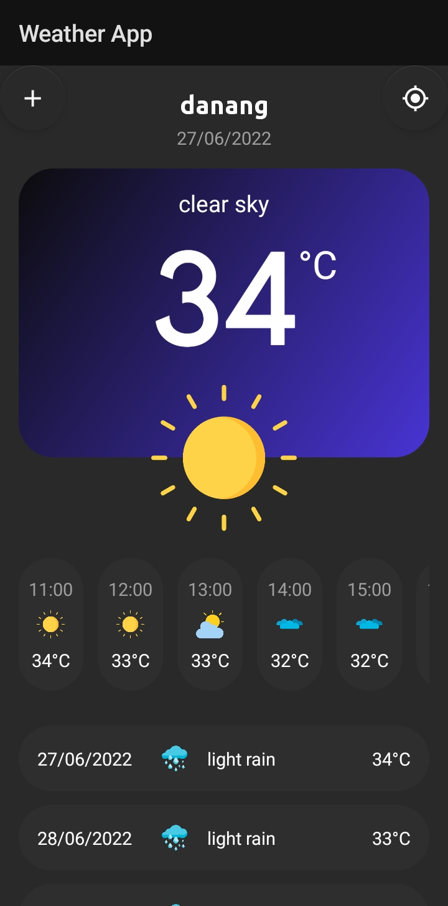
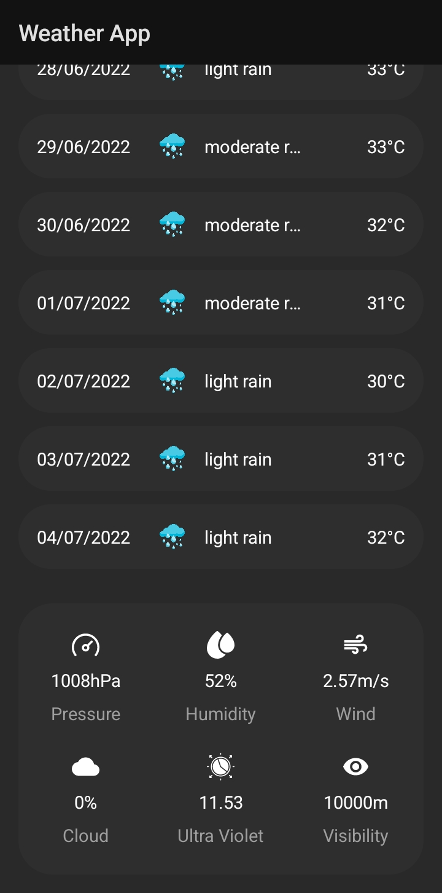
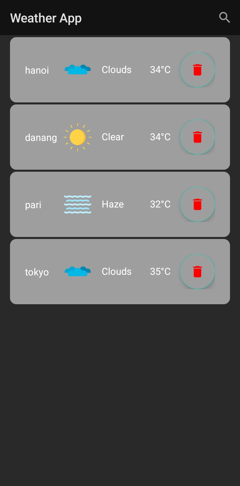

# Weather app

**Requirements**
- Android studio last version
- JDK 8
- Android SDK 31
- Supports API, Adroid-room, GPS

**Highlights**
- Use [OpenWeatherMap] API
- Use locale Database

**Demo** application is available in <a>https://drive.google.com/file/d/1PKTGUTSvJdzi6i1oZW41vlZP0SM0JRuF/view?usp=sharing</a>

**Screenshot**

 

 

 

**Libraries & Dependencies**
- [Support libraries]: recyclerview / linearlayout
- [Gson]: Gson is a Java library that can be used to convert Java Objects into their JSON representation.
- Retrofit [Retrofit]
- [Room]: The Room persistence library provides an abstraction layer over SQLite to allow for more robust database access while harnessing the full power of SQLite
- [ObjextBox]: ObjectBox is a superfast lightweight database for objects
- [viewBinding]: View binding is a feature that allows you to more easily write code that interacts with views.
- [dataBinding]: The Data Binding Library is a support library that allows you to bind UI components in your layouts to data sources in your app using a declarative format rather than programmatically.

**Contact**

gmail: nguyenduyhoa30052001@gmail.com
